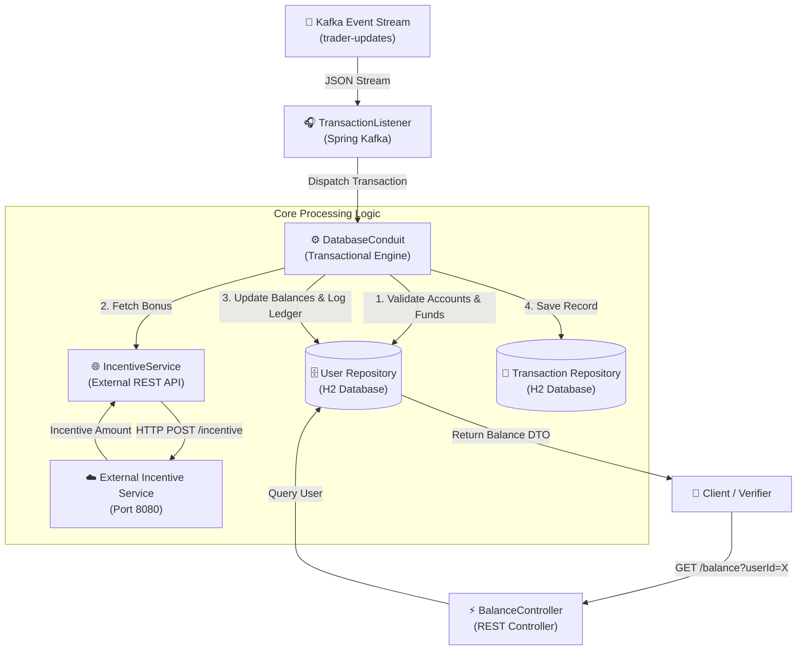

#  PayK Core - Real-Time Financial Transaction & Incentive Processing Engine

[](https://www.oracle.com/java/)
[](https://spring.io/projects/spring-boot)
[](https://kafka.apache.org/)
[](https://spring.io/projects/spring-data-jpa)
[](https://maven.apache.org/)

Developed by **Karan Suthar**

---

##  System Architecture

### End-to-End Component Flow


##  Executive Summary

**payK Core** is an enterprise-grade financial transaction processing engine built using **Spring Boot** and **Apache Kafka**. The service listens to real-time high-throughput financial transfer streams, validates account balances, interacts with external microservices to fetch dynamic transaction incentives, and maintains an immutable audit ledger while providing low-latency REST endpoints for real-time balance queries.

## 🛠️ Technology Stack & Frameworks

| Category | Technology / Library | Version | Description & Purpose |
| :--- | :--- | :--- | :--- |
| **Language** | Java | 17 | Core backend runtime & programming language |
| **Framework** | Spring Boot | 3.2.5 | Microservice foundation, bean container & dependency injection |
| **Event Streaming** | Apache Kafka / Spring Kafka | 3.1.4 | High-throughput real-time message stream ingestion (`trader-updates`) |
| **Database & Persistence** | Spring Data JPA / Hibernate | 3.2.5 | Data access layer for user accounts and transaction ledger entities |
| **In-Memory Database** | H2 Database | 2.2.224 | Fast embedded SQL database for balance management |
| **Web & REST Client** | Spring Web | 3.2.5 | REST Controller (`GET /balance`) & `RestTemplate` external API client |
| **Build & Tooling** | Apache Maven | 3.8+ | Dependency management and build packaging lifecycle |
| **Testing & Emulation** | JUnit 5, Embedded Kafka & Testcontainers | 1.19.1 | End-to-end unit, integration & embedded broker verification tests |

---
---

##  Key Features & Capabilities

- **Event-Driven Transaction Ingestion**: Uses Spring Kafka to continuously consume incoming financial transfer events on the `trader-updates` topic.
-  **Atomic Ledger Processing**: Implements Spring `@Transactional` boundaries to guarantee atomic balance transfers between sender and recipient accounts.
-  **Account & Overdraft Protection**: Validates sender/recipient account existence and ensures the sender has sufficient balance before processing transfers.
-  **External Incentive Microservice Integration**: Integrates with an external incentive API via Spring `RestTemplate` to calculate and apply dynamic promotional bonus amounts to recipient accounts.
-  **REST API Balance Querying**: Exposes light, low-latency REST endpoints to query real-time user balances.
-  **Comprehensive Automated Testing**: Includes embedded Kafka integration testing (`@EmbeddedKafka`) and automated verifiers to test edge cases, error handling, and high-concurrency ingestion.

---

##  Codebase Navigation

Below are direct links to the core components of the project:

- [MidasCoreApplication.java](file:///C:/Users/karan/kafka-mvn-sb/src/main/java/com/jpmc/midascore/MidasCoreApplication.java): Spring Boot application bootstrapper and `RestTemplate` bean context supplier.
- [TransactionListener.java](file:///C:/Users/karan/kafka-mvn-sb/src/main/java/com/jpmc/midascore/component/TransactionListener.java): Kafka listener component consuming real-time transaction messages.
- [DatabaseConduit.java](file:///C:/Users/karan/kafka-mvn-sb/src/main/java/com/jpmc/midascore/component/DatabaseConduit.java): Transactional service managing database persistence, balance adjustments, and transaction logging.
- [IncentiveService.java](file:///C:/Users/karan/kafka-mvn-sb/src/main/java/com/jpmc/midascore/component/IncentiveService.java): REST client integrating with external incentive service (`/incentive`).
- [BalanceController.java](file:///C:/Users/karan/kafka-mvn-sb/src/main/java/com/jpmc/midascore/component/BalanceController.java): REST Controller serving `GET /balance` queries.
- [application.yml](file:///C:/Users/karan/kafka-mvn-sb/src/main/resources/application.yml): Central application and Kafka broker configuration settings.

---

## 🌐 API Reference

### Get User Balance

Query the current available account balance for a given user ID.

- **URL**: `/balance`
- **Method**: `GET`
- **URL Parameters**:
  - `userId` (required, `long`): The unique ID of the user.

#### Sample Request
```bash
curl -X GET "http://localhost:33400/balance?userId=1"
```

#### Response (200 OK)
```json
{
  "amount": 450.75
}
```

---

## 🚀 Getting Started

### Prerequisites

- **Java Development Kit (JDK)**: Version 17 or later
- **Apache Maven**: 3.8+ (or use the included `./mvnw` wrapper)

### Build the Application

To clean and compile the project into an executable JAR file:

```bash
./mvnw clean package
```

### Run Automated Tests

Execute the full suite of unit and integration tests:

```bash
./mvnw test
```

### Run the Application Locally

Start the Spring Boot microservice on port `33400`:

```bash
./mvnw spring-boot:run
```

---

## 👤 Author

**Karan Suthar**  
